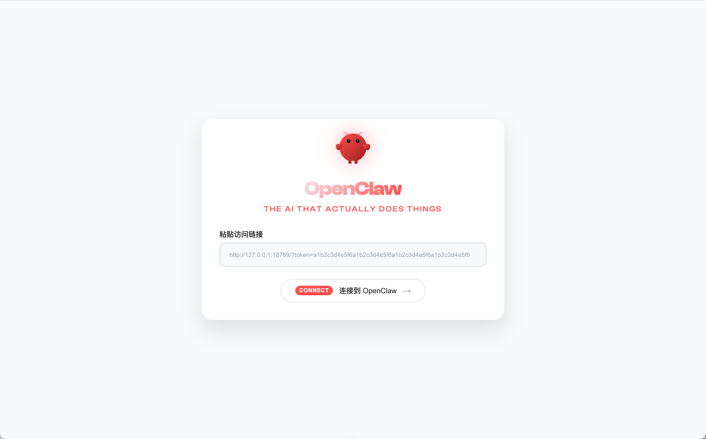
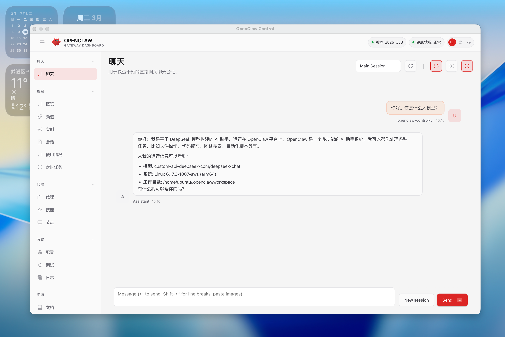

# OpenClaw Desktop

基于 Electron 的桌面客户端，用于访问 OpenClaw Web 服务。

## 功能

- 单窗口架构：设置页面与服务页面在同一窗口内切换
- 通过粘贴访问链接（`http://host:port/?token=xxx`）快速连接服务
- 配置持久化，下次启动自动连接
- 连接失败自动回到设置页面
- 支持 macOS（dmg，已签名 + 公证）和 Windows（portable）打包
- GitHub Actions 自动构建（推送 `v*` tag 触发）

## 快速开始

```bash
npm install
npm start
```

## 打包构建

```bash
# macOS
npm run build

# Windows
npm run build:win

# 全平台
npm run build:all
```

构建产物输出到 `dist/` 目录。

## 截图

### 设置页面


### 桌面主界面


## 使用说明

1. 首次启动显示设置页面，粘贴访问链接后点击 Connect
2. 后续启动自动连接上次配置的地址
3. 可通过菜单 `文件 → 设置`（`Cmd/Ctrl + ,`）修改配置

## 技术栈

- Electron 35
- electron-builder
